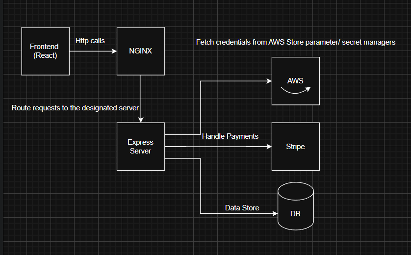

# 🍜🛵 Food Delivery App – Huez

**Huez** is a food delivery application featuring a clean, responsive UI designed for seamless menu browsing, easy order placement, and secure payments—integrated with Stripe for fast and reliable transactions.

---

## 🧠 Architecture Diagram

---

### 🚀 User Features

- 🍱 **Menu Browsing** – Explore a wide variety of delicious dishes  
- 🔍 **Search Functionality** – Quickly find your favorite meals  
- 🧃 **Category Filters** – Easily filter products by category  
- 🔐 **Authentication** – Secure login and user management  
- 🛒 **Cart Management** – Add/remove items and adjust quantities  
- 💳 **Checkout** – Smooth and simple order finalization  
- 🧾 **Stripe Payment Integration** – Safe and fast payments  
- 📱 **Responsive Design** – Works seamlessly on all devices  

### Performance Improvements

- Cursor based pagination for enhanced performance
- Debouncing implementation for search optimization

### Security Features

- Secure payment processing via Stripe gateway
- PCI-compliant React elements integration
- Password protection using bcrypt hashing
- JWT token implementation for secure, scalable sessions
- Comprehensive input validation

## 🛠 Tech Stack

- **Frontend**: React, Tailwind CSS
- **Backend**: Node.js, Express
- **Database**: MongoDB
- **Payments**: Stripe
- **Deployment**: AWS S3 + CloudFront, AWS EC2 (Backend)
